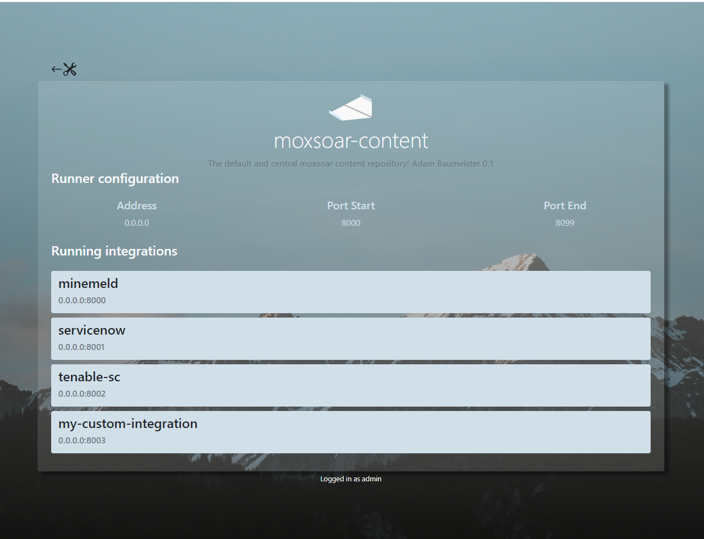

# Advanced Editing

The Moxsoar UI may lag behind in the functionality it provides to editors. In addition, it's often easier to
author content directly from your favourite IDE as opposed to within the UI.

As long as you follow the content layout, you can edit the content directly on disk. 

## Editing an existing integration
Moxsoar uses Git and a simple file structure. This means you can quickly make changes "on the fly".

The easiest way to do this is to mount the content directory somewhere you can edit it. Note the volume specification below.

```bash
adam@docker01:~$ docker run --name moxsoar -d -p 8000-8100:8000-8100 -v /tmp/mxcontent:/etc/moxsoar/content abigserve/moxsoar
adam@docker01:~$ cd /tmp/mxcontent/
adam@docker01:/tmp/mxcontent$ ls -l
total 8
--w----r-- 1 root root  224 May 18 13:29 index.json
drwxr-xr-x 6 root root 4096 May 18 13:29 moxsoar-content
adam@docker01:/tmp/mxcontent$

```

We can then jump into the moxsoar-content directory, and edit the Servicenow integration.

```bash
adam@docker01:/tmp/mxcontent$ cd moxsoar-content/
adam@docker01:/tmp/mxcontent/moxsoar-content$ ls -l
total 16
drwxr-xr-x 2 root root 4096 May 18 13:29 minemeld
-rw-r--r-- 1 root root  271 May 18 13:29 runner.yml
drwxr-xr-x 2 root root 4096 May 18 13:29 servicenow
drwxr-xr-x 2 root root 4096 May 18 13:29 tenable-sc
adam@docker01:/tmp/mxcontent/moxsoar-content$ cd servicenow/
adam@docker01:/tmp/mxcontent/moxsoar-content/servicenow$ ls -l
total 20
-rw-r--r-- 1 root root  100 May 18 13:29 default.json
-rw-r--r-- 1 root root 1196 May 18 13:29 routes.json
-rw-r--r-- 1 root root 2254 May 18 13:29 table.json
-rw-r--r-- 1 root root 2446 May 18 13:29 table_query.json
-rw-r--r-- 1 root root 2254 May 18 13:29 table_update.json
adam@docker01:/tmp/mxcontent/moxsoar-content/servicenow
```

## Routes.json

The route file - routes.json - is unique to each integration and maps paths to response files and parameters. 

A basic routes file, which includes **2 routes** and **3 methods in each route** is below.
```json
{
  "routes": [
    {
      "path": "/api/now/table/incident/",
      "methods": [
        {
          "matchregex": "/api/now/table/incident",
          "httpmethod": "GET",
          "responseFile": "table.json",
          "responseCode": 200
        },
        {
          "matchregex": "/api/now/table/incident",
          "httpmethod": "POST",
          "responseFile": "table.json",
          "responseCode": 200
        },
        {
          "matchregex": "/api/now/table/incident",
          "httpmethod": "PATCH",
          "responseFile": "table.json",
          "responseCode": 200
        }
      ]
    },
    {
      "path": "/api/now/table/",
      "methods": [
        {
          "matchregex": "/api/now/table",
          "httpmethod": "GET",
          "responseFile": "table_query.json",
          "responseCode": 200
        },
        {
          "matchregex": "/api/now/table",
          "httpmethod": "POST",
          "responseFile": "table.json",
          "responseCode": 200
        },
        {
          "matchregex": "/api/now/table",
          "httpmethod": "PATCH",
          "responseFile": "table.json",
          "responseCode": 200
        }
      ]
    }
  ]
}
```

In the above output there are a lot of important paramaters.

Each route must be given a path. The path can be a fixed path or the root of a tree. See the spec listed
[here](https://golang.org/pkg/net/http/#ServeMux) for information.

Each path requires at least one method associated with it. Methods are processed in order and the first match is the 
content that is returned. 

Methods require the following params:

*matchregex*: A regex compatible string that can be used to more granularly route requests.

*httpmethod*: The method used in the HTTP request

*responseFile*: Relative path to the file containing the response body to return

*responseCode*: The http response code to return

If you want to edit an existing path (such as /api/now/table), simply find the responseFile associated with it and edit
it in your preferred text editor.

```bash
vi table.json
```

You can also create your own routes and associated response data by editing routes.json and creating new response files. Easy!

## Creating a new integration
The process for creating a new integration is the same as editing an existing one, except you start by copying it
into a new directory.

Here we copy servicenow into a new integration called "my-custom-integration".

```bash
adam@docker01:/tmp/mxcontent/moxsoar-content$ cp -r servicenow/ my-custom-integration
adam@docker01:/tmp/mxcontent/moxsoar-content$ ls -l
total 20
drwxr-xr-x 2 root root 4096 May 18 13:29 minemeld
drwxr-xr-x 2 root root 4096 May 21 04:14 my-custom-integration
-rw-r--r-- 1 root root  271 May 18 13:29 runner.yml
drwxr-xr-x 2 root root 4096 May 18 13:29 servicenow
drwxr-xr-x 2 root root 4096 May 18 13:29 tenable-sc
```

After creating it, we must update the runner file to tell moxsoar to run this integration. In the below YAML file 
(**runner.yml**) you can see we add my-custom-integration to the "run" directive.

```bash
info:
  description: |
    The default and central moxsoar content repository!
  author: |
    Adam Baumeister
  version: 0.1
runner:
  address: 0.0.0.0
  portmin: 8000
  portmax: 8099
run:
  - integration: minemeld
  - integration: servicenow
  - integration: tenable-sc
  - integration: my-custom-integration
```

Runner updates require a restart of moxsoar, which you can do using docker.

```bash
docker restart moxsoar
```

You will now see your custom integration in the Moxsoar UI, along with the port associated with it!



If you'd like to ingest other, non-default content packs, proceed to [moxsoar and vcs](pack_vcs.md).