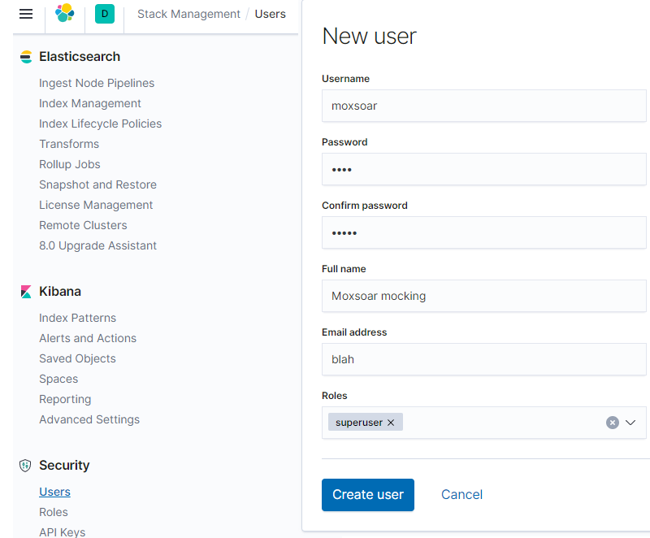
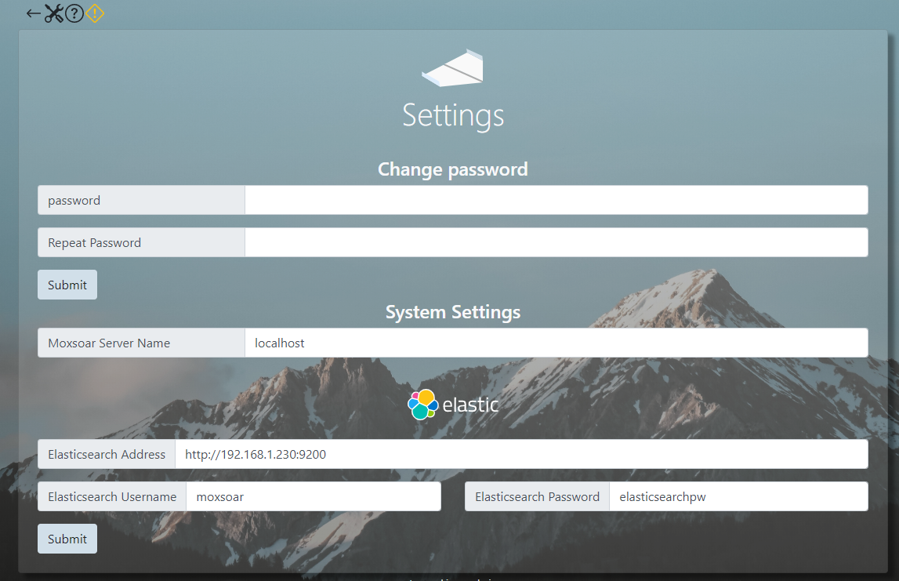
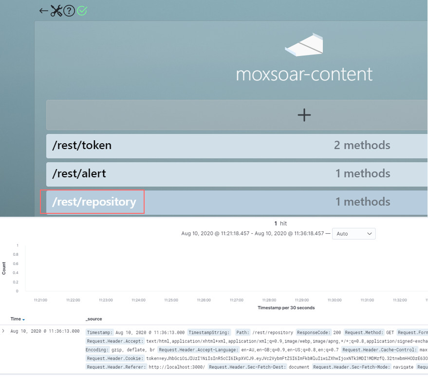

# Request Tracking 

## Elasticsearch 

Moxsoar uses Elasticsearch to perform *request tracking*. Request tracking logs all HTTP requests, including the body
and headers, as Elasticsearch documents so they can be later searched.

You can run Moxsoar without Elasticsearch if you do not need to track requests.

## Quickly Running Elasticsearch

Elasticsearch is not part of Moxsoar, and the intricacies of setting up a properly configured elasticsearch instance 
is out of the scope of this documentation.

However, for convienance, this repo provides a simple [docker compose](../docker-compose.yml) file that will start 
Elasticsearch and Kibana 7.8 quickly for you.

You can run it on any host with docker-compose installed:
```bash
wget -O ./docker-compose.yml https://raw.githubusercontent.com/adambaumeister/moxsoar/request-tracking/docker-compose.yml
docker-compose -f ./docker-compose.yml up 
```

After starting, you must set the built in passwords for Elasticsearch. The following command sets them interactively.
```bash
docker-compose exec elasticsearch ./bin/elasticsearch-setup-passwords interactive
```

After setting your password in Elasticsearch, pass it (and the Kibana user) as environment variables in the docker
compose file.

 ```yaml
     environment:
      - ELASTICSEARCH_USERNAME=kibana_system
      - ELASTICSEARCH_PASSWORD=[ your password here ]
```
```bash
docker-compose -f ./docker-compose.yml restart
```

After these steps have been configured, you can login to Kibana, which by default will listen on tcp/5201 (no TLS!)

## Configuring Elasticsearch in Moxsoar

To connect Moxsoar to Elasticsearch, you must create a user for it. Simply navigate to *Stack Management->Security->Users*
and create a username/password combination. For one-off deployments or quick setups, you can set the role to *superuser*. 



You can now configure Moxsoar to talk to Elasticsearch!

From the Moxsoar UI, you will see a yellow **!** which indicates the Elasticsearch instance is not connected. Click the
*settings* icon and configure the Elasticsearch paramaters: 

* Elasticsearch username/password - these are the values you just configured. 
* Elasticsearch address - By default, the elasticsearch server listens on port **9200**. 



The yellow exclamation should be replaced by a green tick, and it's done! Moxsoar will now forward all requests
to Elasticsearch.

## Creating an Index Mapping

To make the moxsoar data visible in Kibana, you must create an Index Pattern. 

Under *Settings->Kibana->Index Patterns* you can create an index pattern that matches the **moxsoar_tracker_idx** index.

Moxsoar uses the field called **timestamp** for the obvious task of timestamping the data - ensure that this is selected when presented with the
option.

## Viewing your data!

Send a basic request to one of the mock integrations you have configured. You can do this by clicking on a path within
the Moxsoar UI. You will immediately see the request appear in the Kibana Discovery page with all the information.

**Note that this request log will include your access token to the moxsoar UI if you use this method.**


