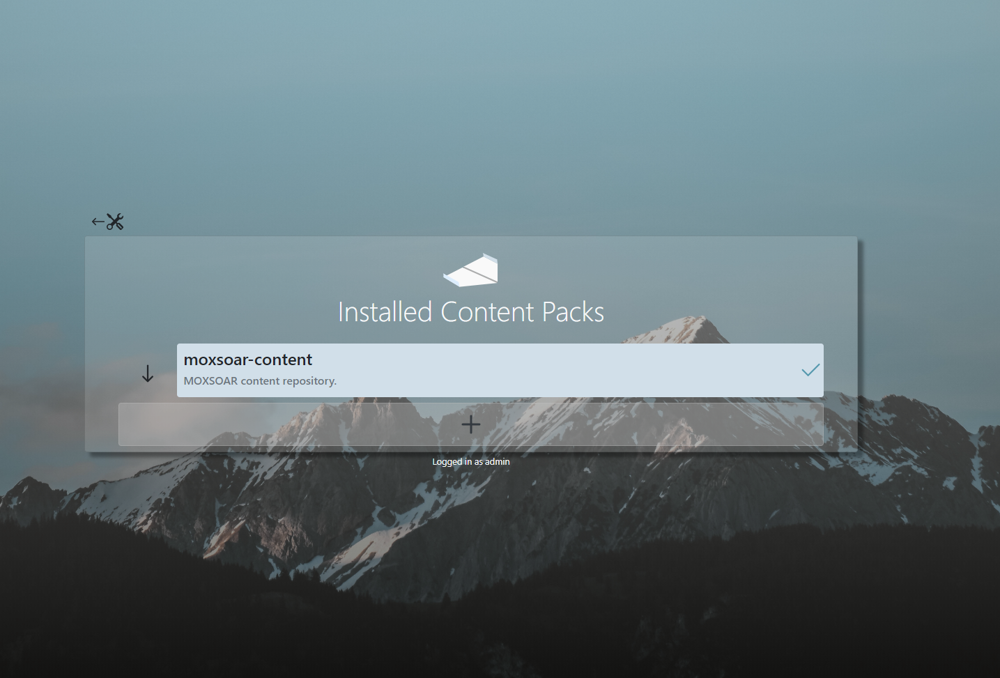
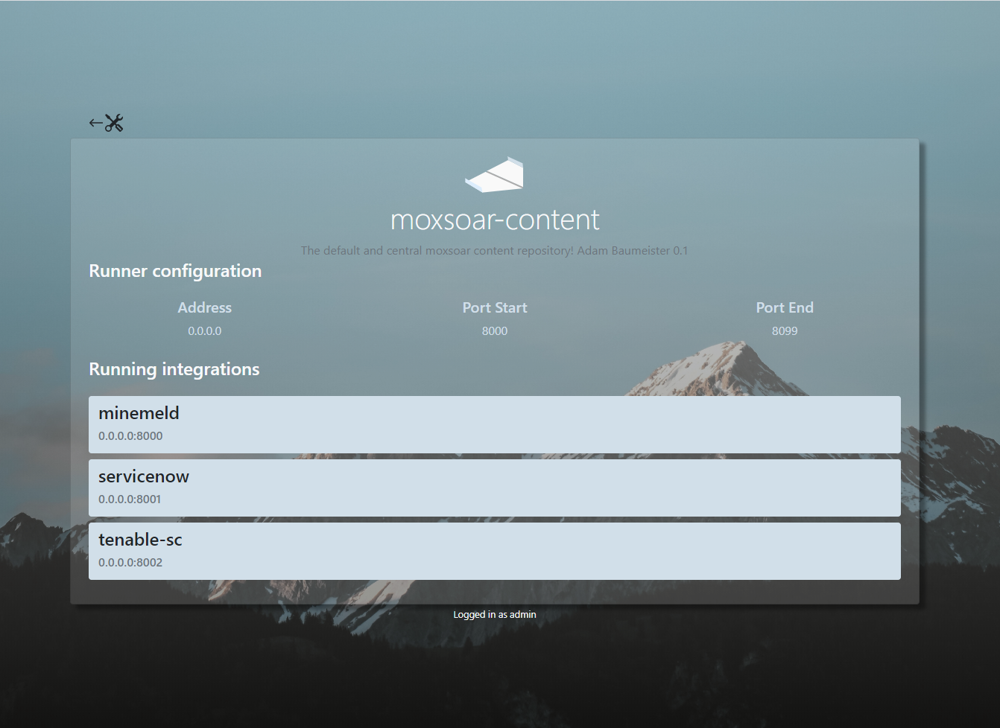

# Getting started Guide
## Content Packs
Start by running the docker container, [here](../README.md). You should be able to open a browser.

You'll be greeted by the content pack page.



Moxsoar uses a concept of "content packs" to manage mock configurations.

Content packs are Git repositories that are accessible to the Moxsoar engine.

Content packs comprise the following:
* A "runner" configuration - which mocks (known internally as **integrations** to run) and which ports to use
* Any number of **integration** configurations

An **integration** is a collection of URL routes, handling logic and response files.

Put it together, and the layout of a complete content pack is as such:
```bash
/runner.yml
    integration1/
        routes.json
        response.json
    integration2/
        routes.json
        response.json
```

Click on the moxsoar-content content pack to view the integrations this pack provides.

*note: moxsoar-content is installed the first time you run moxsoar*.

## Integrations

The integrations screen shows information about the running integrations.

Here you can see which TCP ports are mapped to which API mock. For instance, we see that the "servicenow" integration
is available at TCP port :8001.



**With this information, you can configure your mock consumers whether they are tools like Ansible, 
or custom scripts to point at the Moxsoar server**

For example, to consume the SNOW Mock at :8001 using Ansible you can use the following task

```yaml
- name: Get a mock SNOW incident
  uri:
    url: http//your-moxsoar-server:8001/api/now/table/incident
    method: GET
    status_code: 200
```

You're now using Moxsoar to test your code!

What if you need something that's not in the default content pack? Proceed to [customizing moxsoar](authoring.md)