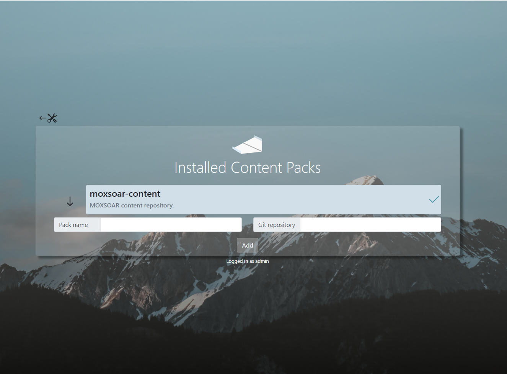

# Content Packs and Version Control

If you are writing custom mocks, it makes sense that you would want to keep and perhaps even share them!

Moxsoar uses Git as the underlying mechanism and adds some functionality to make it easier.

You can add any remote git repository as a content pack through the Moxsoar UI by hitting the big **+** item.

You will need:
* The remote repository URL. HTTPS and SSH are both supported.
* A unique name!

Assuming the clone works, the pack will be "available." To activate and begin using it, simply click it in the 
UI and then hit the 'activate' button. All your configured integrations will be available!

If the remote repository is updated, you can simply click the down arrow to the left of the pack to pull any changes.

*Note: Currently only the master branch is supported for Packs.*

