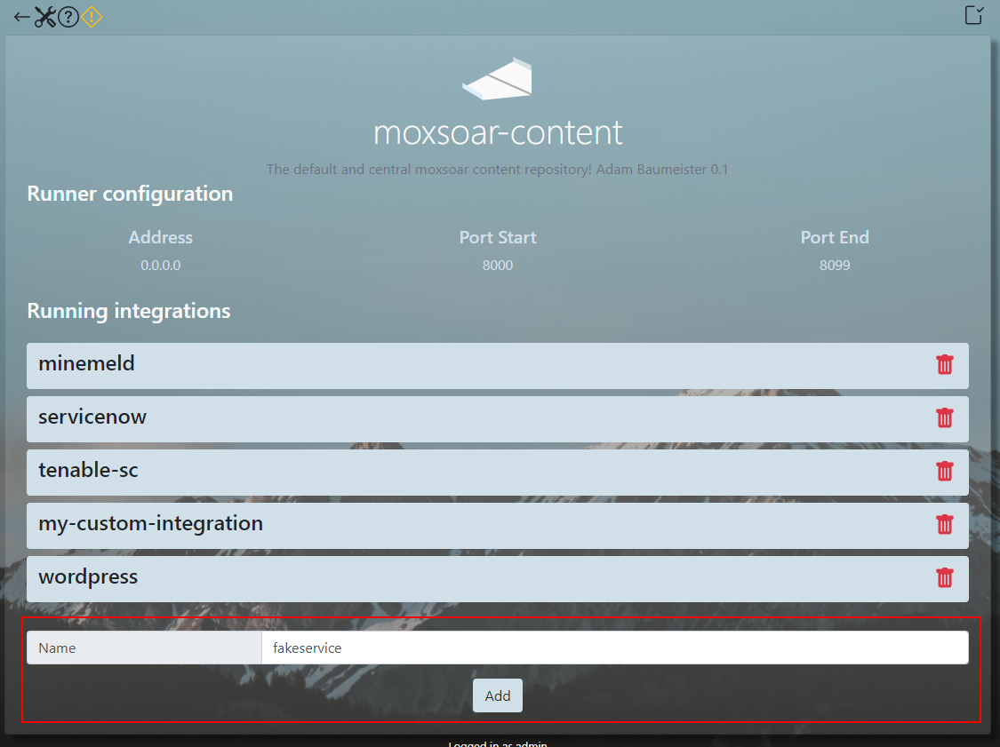
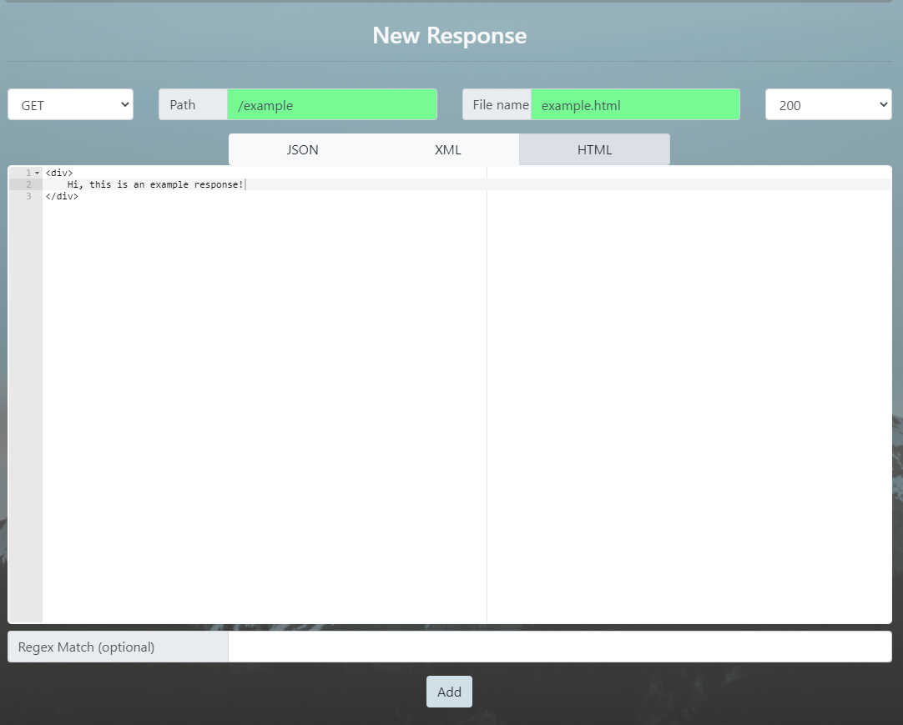

# Writing content via the UI

The Moxsoar UI provides a straight forward interface for creating mock content.

You can use the UI exclusively, or a combination of manual edits and UI edits!

## Creating a New integration

Generally, you will start by creating a new integration. Remember an integration is simply a collection of parameters 
(routes and response data) along with an associated port.

From the main page, select the pack you want to edit - the existing integrations will be displayed. Hit the new button
and enter a name for your new integration - in the example, we are going to use *fakeservice*.

 

You'll see it get added to the list. If you click on it, you'll get the edit page for the integration.

There won't be any routes yet - you need to add the first one! Click the giant + button and a form appears.

This form allows you to craft a response based on given match parameters - note you're effectively editing a file on disk, same as you would be doing 
it [the manual way](authoring.md). 

The fields should be self explanatory - choose a method, path, and code to respond with, enter the response data, and 
finally give it a filename. 

 

After hitting add, you will see the new path appear. Click on the path text, and a new window will automatically open,
taking you to the path - you should see your response data! 


MOXSOAR uses a combination of the Golang HTTP server URI parsing and a "longest match" function to determine, when an
inbound request comes in, how it's routed to the correct response.

Ideally your path specs should be as accurate as possible, with a final "catch all" (usually matching */* ). 

## Regex matching

Along with the other match specs, you can optionally add a regex match to the given path. 

This will run after the base path matches, so for example;

```
GET /test
path=/test regex='.*matchme'
NO MATCH

/GET /test/matchme
path=/test regex='.*matchme'
MATCH
``` 

You can use this to perform fairly complex URI routing for responses.

## Using variables in responses

Moxsoar provides the ability to use *variables* in responses to customize the response body.

This can be useful when writing content as you may want to be able to customize some aspects of it - for instance,
when faking a ServiceNow ticket, you may want to parametize the response description and ID. 

You can create new variables from the *settings* page. 

To use a variable in a response body, reference it using the simple identifier, **$(varname)**

For example, given a variable named *FOO*, with value *BAR* we can use it in a HTML response body as such;

```html
<div>
    $(FOO)
</div>
``` 

which, when matching a request, returns;

```html
<div>
    BAR
</div>
```

Now you've built some custom content, you may want to [track requests for it](elasticsearch.md).
